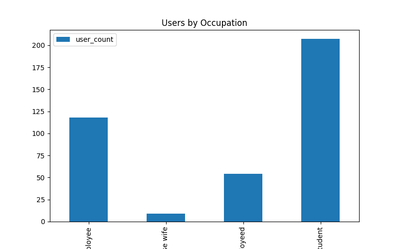

# Delivery Data Analysis Project

배달 플랫폼 사용자 데이터를 분석하여
사용자 특성과 온라인 주문 패턴을 분석한 데이터 분석 프로젝트입니다.

---

## 프로젝트 목표

* 사용자 특성 분석
* 온라인 주문 여부 분석
* 직업/연령/결혼 여부와 주문 관계 분석
* SQL 기반 데이터 집계 및 시각화

---

## 사용 기술

* Python
* Pandas
* Matplotlib
* SQLite
* SQL
* Jupyter Notebook

---

## 데이터셋

* Online Food Orders Dataset

주요 컬럼:

* Age
* Gender
* Occupation
* Monthly Income
* Marital Status
* Output

---

## 주요 분석 내용

### 1. 연령 분포 분석

* 20대 사용자 비율이 높게 나타남

### 2. 직업별 사용자 분석

* Student 그룹 비율이 높게 나타남

### 3. 온라인 주문 여부 분석

* 온라인 주문 사용자 비율이 높게 확인됨

### 4. SQL 기반 집계 분석

* GROUP BY를 활용한 사용자 분석
* AVG를 활용한 평균 연령 분석

---

## 프로젝트 구조

```bash
delivery-analysis/
│
├── data/
├── notebooks/
│   └── delivery_analysis.ipynb
├── sql/
│   └── analysis.sql
├── visualization/
│   └── occupation_chart.png
├── venv/
├── README.md
└── requirements.txt
```

---

## 시각화 결과



---

## 실행 방법

```bash
pip install -r requirements.txt
jupyter notebook
```
